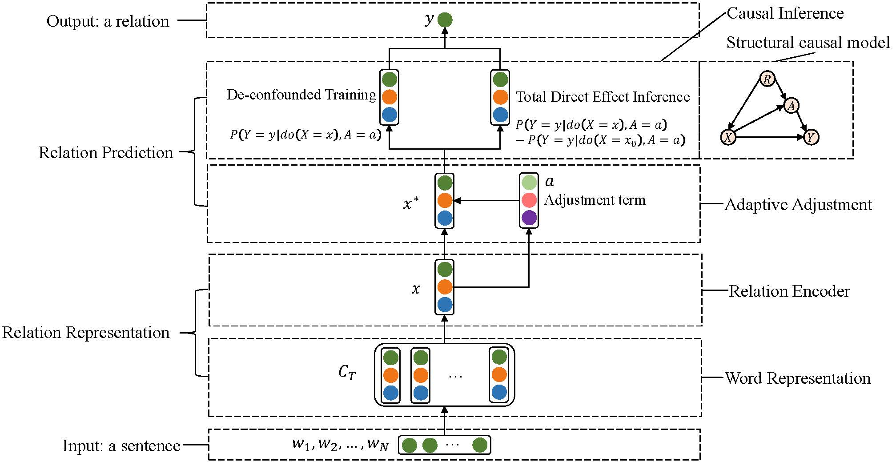

# Improving long-tail relation extraction via adaptive adjustment and causal inference

# 基于因果推理和类别调整的长尾实体关系抽取方法

This project includes the code implemented with PyTorch and the paper **Improving Long-tail Relation Extraction via Adaptive Adjustment and Causal Inference** published in the **Neurocomputing 2023** journal.

该工程为论文**基于因果推理和类别调整的长尾实体关系抽取方法**的代码，该文章发表至Neurocomputing期刊。

https://doi.org/10.1016/j.neucom.2023.126563



## 训练（Training）
```
python train_tjy_la.py --id [saved_models/your_model_name] --seed 1234 --effect_type None --lr 1 --num_epoch 40 --pooling max --mlp_layers 2 --pooling_l2 0
```
对于NYT24数据集的模型：saved_models/CGCN-De-confound-TDE-63  
对于NYT数据集的模型：saved_models/CGCN_nyt10_adjust_alpha_05_53_epoch_40
## 评估（Evaluation）

To run evaluation on the test set for CGCN, run:
```
python eval.py [saved_models/your_model_name] --dataset test
```

## 模型保存（Model Saving）
saved_models中保存的模型：https://drive.google.com/drive/folders/1WJZh7yLRr8m2O9PNUaAd7lQX2yaBHi0t?usp=drive_link

